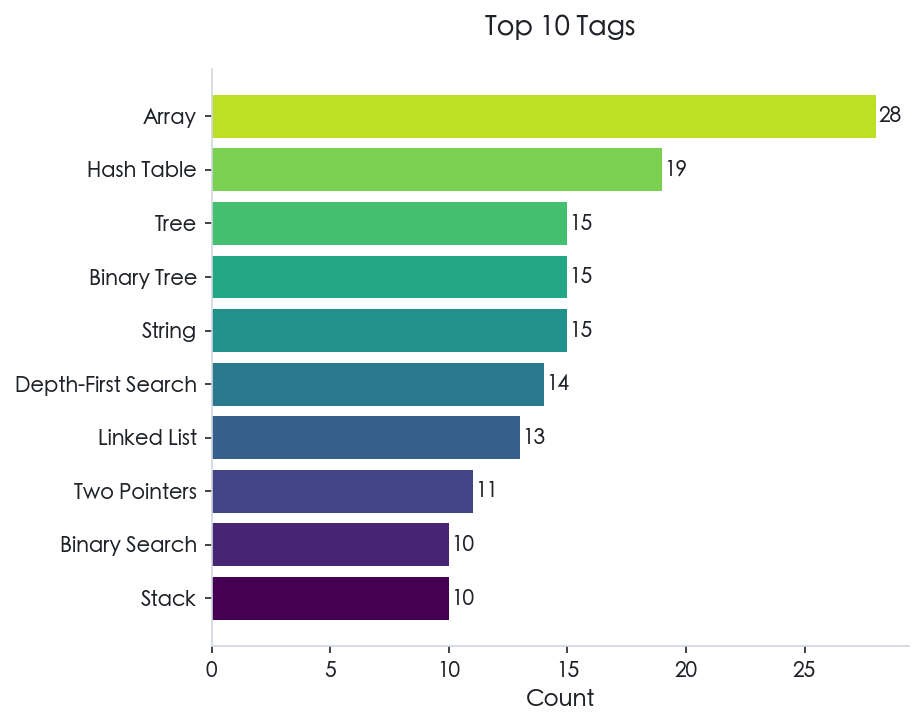
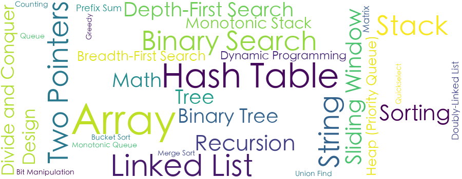

<h1 align="center">📚 Algorithm</h1>

<p align="center">
  A data structures and algorithms learning repository based on Go language, combining LeetCode practice and various learning resources (books, tutorials, blogs, videos).
</p>

<p align="center">
  <a href="https://go.dev/"></a>
  <a href="https://obsidian.md/"></a>
  <a href="https://github.com/astral-sh/uv"></a>
  <a href="https://www.python.org/"></a>
  <a href="./LICENSE"></a>
</p>

<p align="center">
  English | <a href="./README_zh.md">中文</a>
</p>

<p align="center">
  
</p>

This project integrates various learning resources (books, tutorials, blogs, videos) on data structures and algorithm analysis with the practical platform LeetCode. It aims to build a comprehensive algorithm knowledge system through a trinity approach of "theoretical learning + coding practice + documentation accumulation."

The project documentation is organized using Obsidian, supporting full-repository bidirectional linking for seamless switching between theoretical analysis and code implementation.

## 📖 Project Introduction

- **LeetCode Problem Solving**: Select high-frequency algorithm problems, implement them in Go, and include comprehensive unit tests.

- **Go Data Structures (gods)**: Custom implementations of common data structures (lists, trees, heaps, stacks, queues, hash tables, etc.) from scratch for deep learning.

- **Obsidian Knowledge Base**: Record problem-solving ideas, complexity analysis, and study notes in the `docs` directory to build a personal algorithm encyclopedia.

- **AI Empowerment**: Planned intelligent translation and RAG-based Q&A assistant to enhance learning efficiency using modern technology.

<!-- STATS_START -->
## 📊 LeetCode Progress

Currently, this repository contains solutions to **56** LeetCode problems, covering a range of difficulty levels and algorithmic topics.

| Total | Easy | Medium | Hard |
|:-----:|:----:|:------:|:----:|
| 56 | 15 | 32 | 9 |

The pie chart below shows the distribution of problems by difficulty level, while the bar chart highlights the top 10 most frequently encountered tags. The majority of problems fall into the **Medium** category, with a focus on fundamental topics like Array, Hash Table, Linked List.

<p align="center">
  <picture>
    <source media="(prefers-color-scheme: dark)" srcset="./assets/stats/difficulty_distribution_en_dark.png">
    <source media="(prefers-color-scheme: light)" srcset="./assets/stats/difficulty_distribution_en_light.png">
    
  </picture>
  <picture>
    <source media="(prefers-color-scheme: dark)" srcset="./assets/stats/top_tags_en_dark.png">
    <source media="(prefers-color-scheme: light)" srcset="./assets/stats/top_tags_en_light.png">
    
  </picture>
</p>

The word cloud below provides a visual overview of all tags covered in this repository, with larger words indicating more frequently practiced topics.

<p align="center">
  <picture>
    <source media="(prefers-color-scheme: dark)" srcset="./assets/stats/tag_cloud_en_dark.png">
    <source media="(prefers-color-scheme: light)" srcset="./assets/stats/tag_cloud_en_light.png">
    
  </picture>
</p>

<!-- STATS_END -->

## 💡 Why Golang

Selecting the right programming language is crucial for learning data structures and algorithms. This project adopts Go for the following reasons:

1. **Pointers for Data Structures**: The best way to understand data structures is through a language with explicit pointers (C, C++, Go, Rust). Pointers provide direct visibility into memory layout, making concepts like linked lists, trees, and graphs more tangible.

2. **Rich Standard Library for Algorithms**: Effective algorithm learning benefits from built-in data structures and algorithms in the standard library. This eliminates C from consideration, as it lacks comprehensive built-in containers.

3. **Simple Build System and Testing**: To focus on data structures and algorithms themselves—rather than fighting with build tools—a language should offer a straightforward build system and unit testing. This rules out C++, where setting up a proper testing environment can be cumbersome.

4. **Accessibility and Practicality**: While Rust meets the technical criteria above, its ownership model makes implementing certain data structures (like linked lists) overly complex, and its steep learning curve can distract from algorithmic concepts. In contrast, Go satisfies all requirements while offering:
   - Simple, clean syntax that's easy to learn
   - Built-in testing framework with excellent tooling
   - Direct applicability to real-world scenarios (backend development, microservices, cloud-native applications)

Go strikes an ideal balance: it's simple enough for learning yet powerful enough for production use, making it the perfect choice for building a bridge between theoretical understanding and practical application.

## 🚀 Quick Start

### Environment Dependencies

- **Go**: 1.25+
- **Obsidian**: Recommended for the best documentation reading experience.

### Running and Testing

1. **Clone the Repository**

```bash
$ git clone https://github.com/MorePeanuts/algorithm.git
$ cd algorithm
```

2. **Run Tests** Each LeetCode problem comes with test files:

```bash
# Test a specific problem (quick way)
$ ./lc-test.sh 0001

# Test a specific problem (full path)
$ go test ./leetcode/0001-0100/0001_two_sum/...

# Run all tests
$ go test ./...
```

3. **Crawl LeetCode Problems** Use the crawler tool to fetch problem descriptions and generate templates:

```bash
$ uv sync
$ source .venv/bin/activate
$ crawler https://leetcode.cn/problems/two-sum/
```

4. **Enable Auto Statistics Update** (Optional) The progress statistics and charts can be automatically updated when you commit with a message containing "Add leetcode":

```bash
# Enable the git hook
$ git config core.hooksPath .githooks

# Now when you commit like this:
$ git commit -m "Add leetcode 0001_two_sum solution"
# The statistics will be auto-updated and included in your commit
```

To manually update statistics:

```bash
$ uv run --package lc-stats lc-stats
```

## 📁 Repository Structure

```plain
.
├── assets/                      # Static assets (images, etc.)
├── gods/                        # Go Data Structures - custom implementations
│   ├── tree/                    # Tree data structures
│   ├── hash/                    # Hash-based structures
│   ├── heap/                    # Heap implementations
│   ├── list/                    # Linked lists and list structures
│   ├── queue/                   # Queue implementations
│   └── stack/                   # Stack implementations
├── leetcode/                    # LeetCode problem-solving code
│   └── 0001-0100/               # Grouped by problem number range
│       └── 0001_two_sum/
│           ├── solution.go      # Core algorithm
│           └── solution_test.go # Unit tests
├── docs/                        # Obsidian documentation library root
│   └── leetcode/                # Problem descriptions and solution analyses (linked to source code)
├── python/                      # Python tools workspace (uv)
│   ├── crawler/                 # LeetCode problem crawler
│   ├── test-gen/                # Unit test generator
│   └── auto-docs/               # Documentation automation
├── go.mod                       # Go module configuration
└── README.md
```

Documents are stored in the `docs/` directory, following these principles:

1. **Structured**: Named as `problem_number_problem_name.md`, corresponding to the code directory.
2. **Code Linking**: Link to Go source files in Markdown.

## 🛠️ Future Feature Plans

- **Automated Unit Test Generation**: Leverage AI agents to automatically generate comprehensive unit tests based on problem descriptions, ensuring thorough test coverage for algorithm implementations.

- **Intelligent Chinese-English Documentation Translation Agent**: Develop an LLM Agent to automatically monitor changes in `docs` and translate Chinese notes into English, maintaining bilingual synchronization.

- **RAG-Based Intelligent Q&A Assistant**: Build a knowledge index based on the local `docs` library; implement Q&A combining theory and practice, e.g., "How is a hash table implemented? What related problems are there on LeetCode?"

## 📜 License

This project is licensed under the MIT License. See [LICENSE](./LICENSE) for details.
