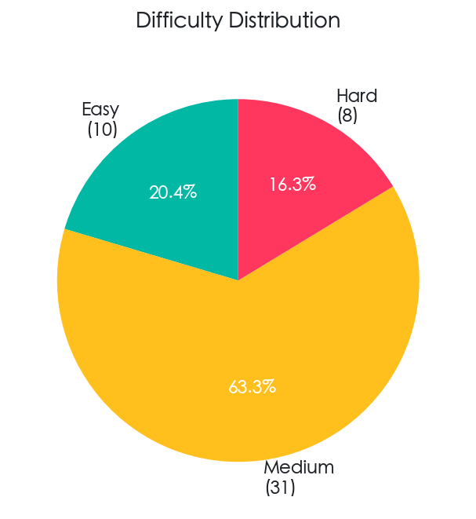
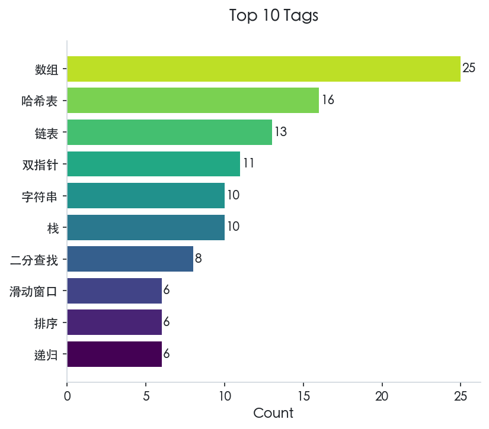
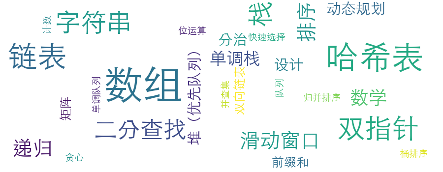

<h1 align="center">📚 Algorithm</h1>

<p align="center">
  一个基于 Go 语言、结合 LeetCode 实践与多种学习资源（书籍、教程、博客、视频）的数据结构与算法学习仓库。
</p>

<p align="center">
  <a href="https://go.dev/"></a>
  <a href="https://obsidian.md/"></a>
  <a href="https://github.com/astral-sh/uv"></a>
  <a href="https://www.python.org/"></a>
  <a href="./LICENSE"></a>
</p>

<p align="center">
  <a href="./README.md">English</a> | 中文
</p>

<p align="center">
  
</p>

本项目结合了多种数据结构与算法分析的学习资源（书籍、教程、博客、视频）与实战平台 LeetCode，旨在通过"理论学习 + 编码实践 + 文档沉淀"三位一体的方式，构建完整的算法知识体系。

项目文档采用 Obsidian 组织，支持全库双链跳转，方便在理论分析与代码实现之间无缝切换。

## 📖 项目简介
- **LeetCode 刷题**：精选高频算法题，使用 Go 语言实现，并附带详尽的单元测试。
- **Go 数据结构 (gods)**：从零开始自定义实现常见数据结构（链表、树、堆、栈、队列、哈希表等），用于深度学习理解。
- **Obsidian 知识库**：在 docs 目录下记录解题思路、复杂度分析与学习笔记，打造个人算法百科。
- **AI 赋能**：规划中的智能翻译与 RAG 答疑助手，利用现代技术提升学习效率。

<!-- STATS_START -->
## 📊 LeetCode 解题进度

目前，本仓库已收录 **49** 道 LeetCode 题目的解答，涵盖不同难度级别和多种算法主题。

| 总计 | 简单 | 中等 | 困难 |
|:----:|:----:|:----:|:----:|
| 49 | 10 | 31 | 8 |

下方饼图展示了题目的难度分布，条形图则列出了出现频率最高的 10 个标签。可以看到，大部分题目集中在**中等**难度，重点练习了数组、哈希表、链表等基础主题。

<p align="center">
  <picture>
    <source media="(prefers-color-scheme: dark)" srcset="./assets/stats/difficulty_distribution_zh_dark.png">
    <source media="(prefers-color-scheme: light)" srcset="./assets/stats/difficulty_distribution_zh_light.png">
    
  </picture>
  <picture>
    <source media="(prefers-color-scheme: dark)" srcset="./assets/stats/top_tags_zh_dark.png">
    <source media="(prefers-color-scheme: light)" srcset="./assets/stats/top_tags_zh_light.png">
    
  </picture>
</p>

下方词云图直观呈现了本仓库涉及的所有标签，字体越大表示该主题的练习频率越高。

<p align="center">
  <picture>
    <source media="(prefers-color-scheme: dark)" srcset="./assets/stats/tag_cloud_zh_dark.png">
    <source media="(prefers-color-scheme: light)" srcset="./assets/stats/tag_cloud_zh_light.png">
    
  </picture>
</p>

<!-- STATS_END -->

## 💡 为什么选择 Go

选择合适的编程语言对学习数据结构与算法至关重要。本项目选择 Go 语言，基于以下考量：

1. **指针助力数据结构学习**：理解数据结构的最佳方式是使用具有显式指针的语言（C、C++、Go、Rust）。指针能够直观展示内存布局，让链表、树、图等概念更加具体可感。

2. **丰富标准库支撑算法实践**：有效的算法学习需要语言内置的数据结构和算法支持。这一点排除了 C，因为它缺乏完善的标准库容器。

3. **简洁的构建与测试体系**：为了专注于数据结构和算法本身——而不是与构建工具缠斗——语言应当提供开箱即用的构建系统和单元测试。C++ 在配置测试环境方面的复杂性使其不太适合这一场景。

4. **易学性与实用性兼顾**：虽然 Rust 在技术上满足上述要求，但其所有权模型使得某些数据结构（如链表）的实现变得复杂，而且陡峭的学习曲线可能分散对算法概念本身的注意力。相比之下，Go 不仅满足所有技术要求，还具备：
   - 简洁清晰的语法，易于上手
   - 内置测试框架，工具链完善
   - 直接贴近实际业务场景（后端开发、微服务、云原生应用）

Go 在两者间取得了理想的平衡：既足够简单用于学习，又足够强大用于生产，是连接理论理解与实践应用的绝佳选择。

## 🚀 快速开始
### 环境依赖
- **Go**: 1.25+
- **Obsidian**: 推荐安装以获得最佳文档阅读体验

### 运行与测试
1. **克隆仓库**
```bash
$ git clone https://github.com/MorePeanuts/algorithm.git
$ cd algorithm
```
    
2. **运行测试** 每个 LeetCode 题目均配有测试文件：
```bash
# 测试特定题目（快捷方式）
$ ./lc-test.sh 0001

# 测试特定题目（完整路径）
$ go test ./leetcode/0001-0100/0001_two_sum/...

# 运行所有测试
$ go test ./...
```

3. **爬取 LeetCode 题目** 使用爬虫工具获取题目描述并生成模板：
```bash
$ uv sync
$ source .venv/bin/activate
$ crawler https://leetcode.cn/problems/two-sum/
```

4. **启用自动统计更新**（可选）当提交信息中包含 "Add leetcode" 时，进度统计和图表会自动更新：

```bash
# 启用 git hook
$ git config core.hooksPath .githooks

# 之后当你这样提交时：
$ git commit -m "Add leetcode 0001_two_sum solution"
# 统计信息会自动更新并包含在你的提交中
```

手动更新统计信息：

```bash
$ uv run --package lc-stats lc-stats
```

## 📁 仓库结构
```plain
.
├── assets/                      # 静态资源（图片等）
├── gods/                        # Go 数据结构 - 自定义实现
│   ├── tree/                    # 树数据结构
│   ├── hash/                    # 哈希相关结构
│   ├── heap/                    # 堆实现
│   ├── list/                    # 链表和列表结构
│   ├── queue/                   # 队列实现
│   └── stack/                   # 栈实现
├── leetcode/                    # LeetCode 刷题代码
│   └── 0001-0100/               # 按题号区间分组
│       └── 0001_two_sum/
│           ├── solution.go      # 核心算法
│           └── solution_test.go # 单元测试
├── docs/                        # Obsidian 文档库根目录
│   └── leetcode/                # 题目描述、解法分析（链接至源码）
├── python/                      # Python 工具工作区 (uv)
│   ├── crawler/                 # LeetCode 题目爬虫
│   ├── test-gen/                # 单元测试生成器
│   └── auto-docs/               # 文档自动化工具
├── go.mod                       # Go 模块配置
└── README.md
```

文档存储在 `docs/` 目录下，遵循以下原则：
1. 结构化：按照 `题号_题目名称.md` 命名，保持与代码目录对应。
2. 代码链接：在 Markdown 中链接至 Go 源码文件。
## 🛠️ 后续功能规划

- **自动单元测试生成**：利用智能体根据题目描述自动生成全面的单元测试，确保算法实现拥有充分的测试覆盖。
- **中英文档自动翻译智能体**：开发一个 LLM Agent，自动监听 docs 变动并将中文笔记翻译为英文，保持双语同步。
- **基于 RAG 的智能答疑助手**：基于本地 docs 库构建知识索引；实现"理论 + 实践"结合的问答，例如："哈希表如何实现？LeetCode 中有哪些相关题目？"

## 📜 License
本项目采用 MIT License，详见 [LICENSE](./LICENSE)。
